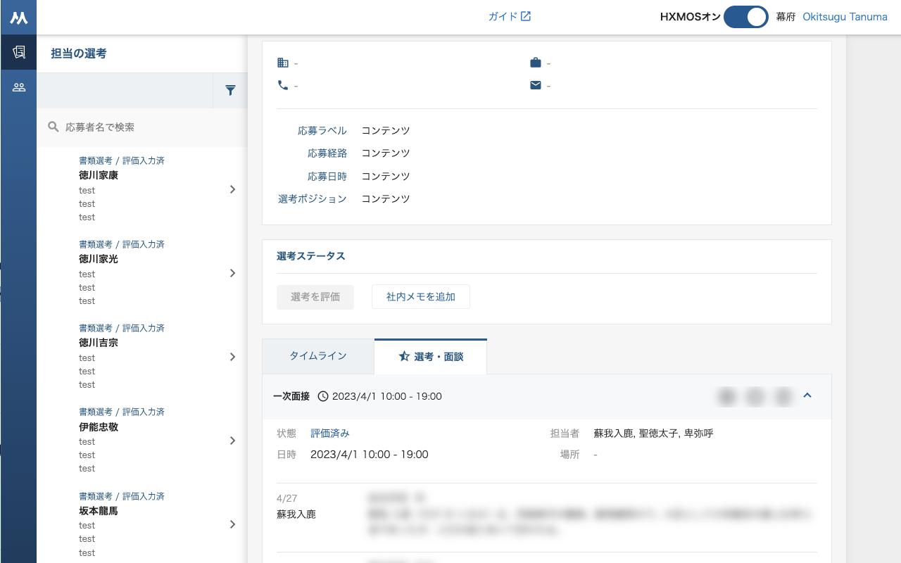
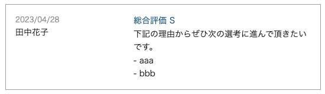

 HRMOS  の評価入力でお困りの方にピッタリの Google Chrome 拡張機能

# はじめての方へ

- [chrome ウェブストア](https://chrome.google.com/webstore/detail/hxmos/pcfpmfdckhdbcmbbhlmfheplnoilehhd?hl=ja) からダウンロードできます。
- [公式サイト](https://sites.google.com/kosui.me/hxmos)

# HRMOS の評価入力でお困りの方へ

Google Chrome 拡張機能「HXMOS」は、採用管理システム「HRMOS」利用時のこんな悩みを解決します。

### 😭 従来

いきなり他の人の評価結果が表示され、評価入力時にバイアスがかかってしまいます。

### ✨ HXMOS 導入後

ワンクッションが置かれているため、自分のタイミングで他の人の評価結果を閲覧できます。

